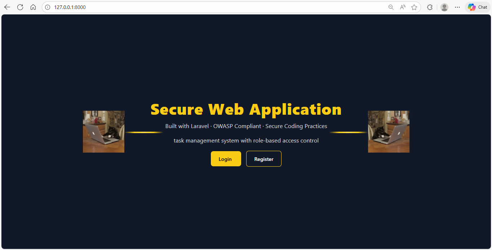
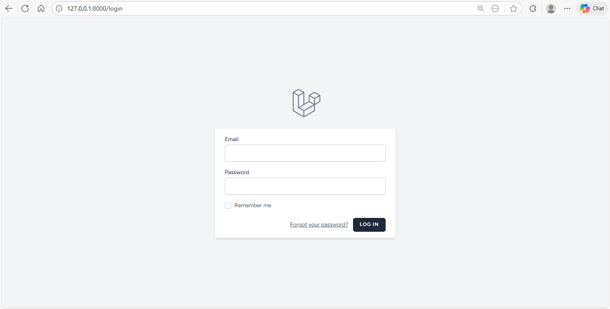
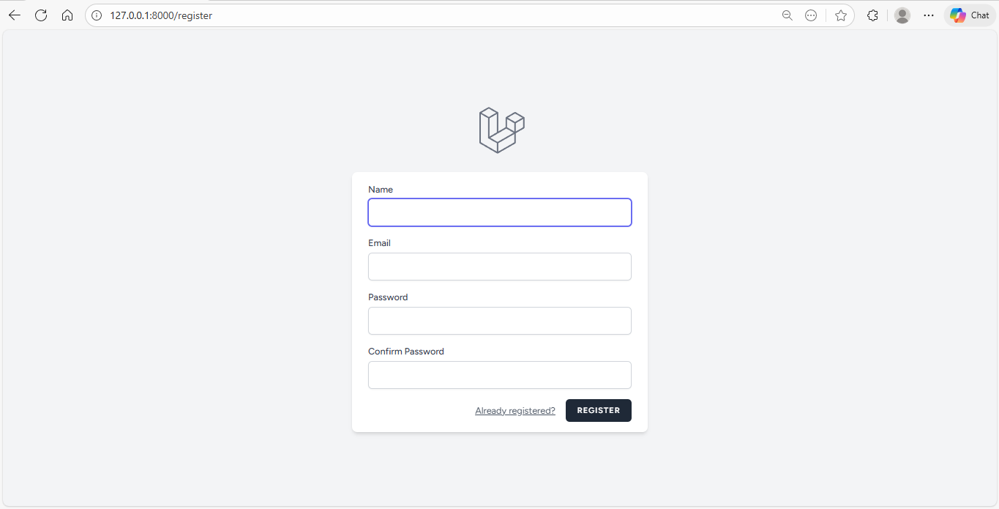
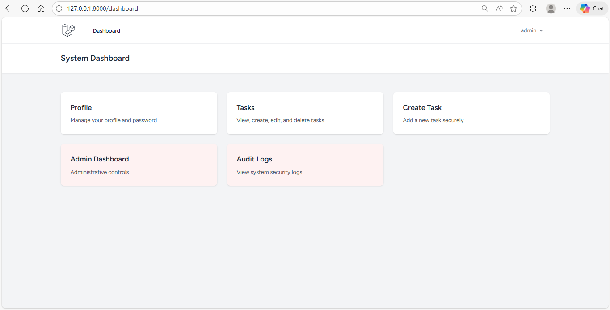
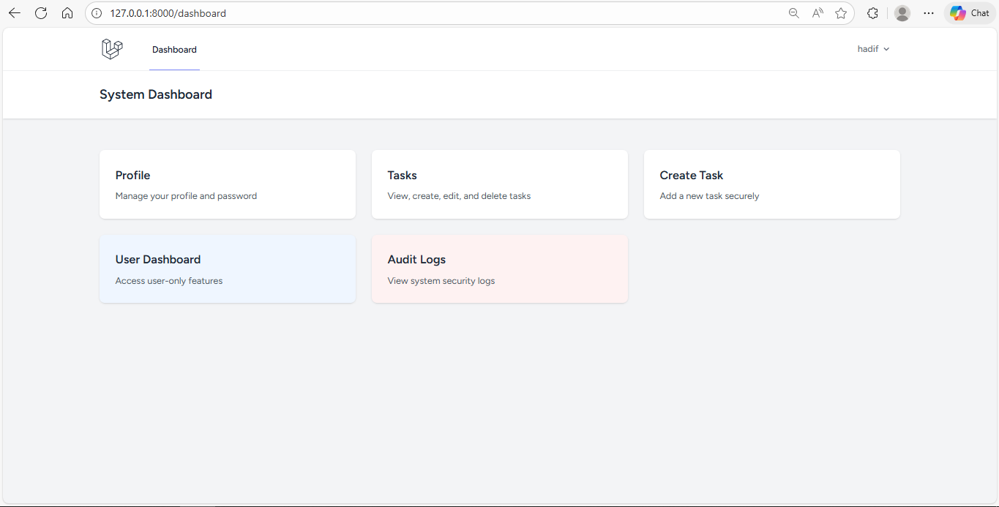
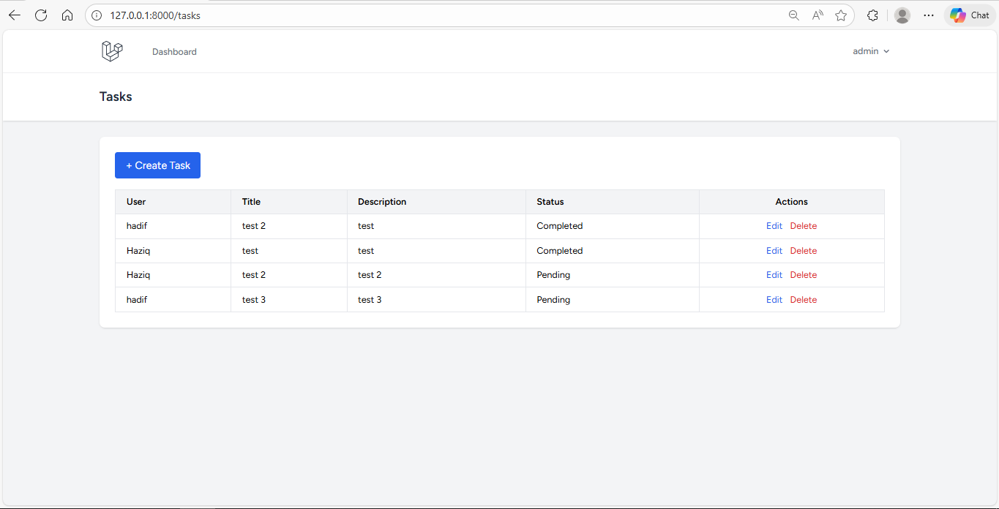
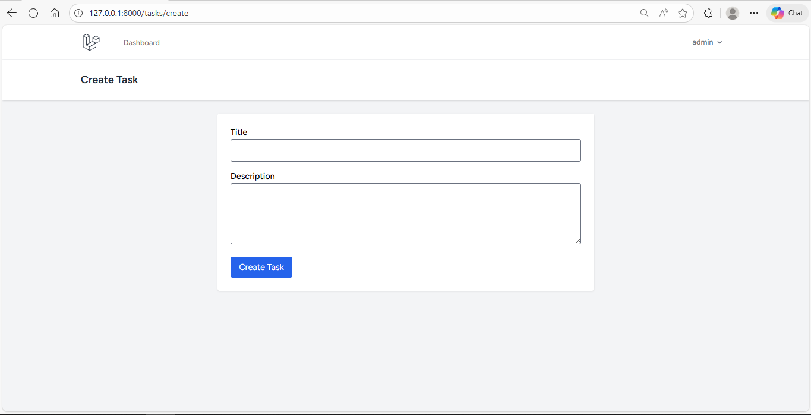
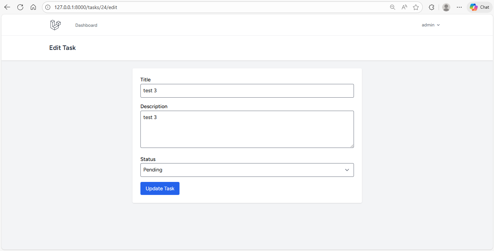
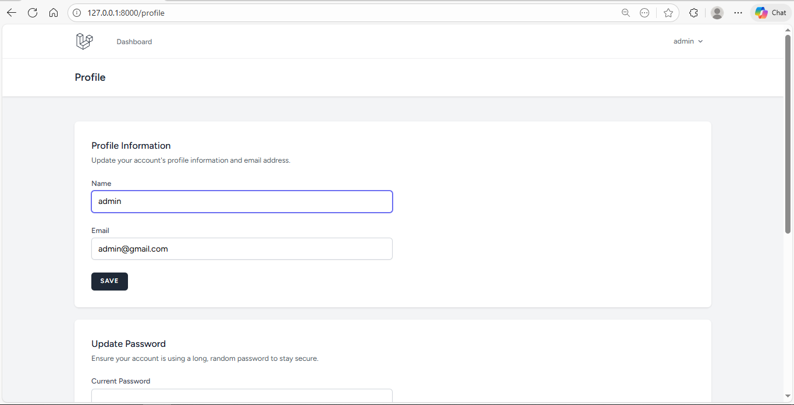

Secure Web Application

OWASP-Compliant Development (Laravel)

This project is a secure web application built with Laravel, focusing on the OWASP Top 10 and ASVS standards. It features Role-Based Access Control (RBAC), secure CRUD operations, and an automated Audit Logging system.

[Dependencies]

Backend

Laravel Framework

Spatie Laravel Permission

Laravel Breeze (Authentication)

Frontend

Blade Templating Engine

Tailwind CSS

Vite

----------------------------------------------------------------------------------------------------------------------------------

1. Prerequisites (What to Download)

Before starting, ensure you have the following installed:

PHP (8.1 or higher): Download PHP (Usually included in XAMPP).

XAMPP or Laragon: To run the Apache server and MySQL database.

Composer: Download Composer (PHP Package Manager).

Node.js & NPM: Download Node.js (Required for frontend assets).

Code Editor: Visual Studio Code (Recommended).

2. Application Stack

Framework: Laravel 10.x

Authentication: Laravel Breeze (Session-based)

Database: MySQL / MariaDB

Frontend: Blade Templates + Tailwind CSS3. 

Installation Steps

Step 1: Clone or Create the Project
If you are setting this up for the first time:

composer create-project laravel/laravel secure-app
cd secure-app

Step 2: Install Backend Dependencies

composer install

Step 3: Install Frontend Dependencies

npm install

npm run build

4. Database SetupStart MySQL: 

Open your XAMPP/Laragon control panel and start the MySQL service.

Create Database: Open phpMyAdmin (usually http://localhost/phpmyadmin) and create a new database named secure_web_app.

Configure Environment: Open the .env file in your project root and update the database settings:

DB_CONNECTION=mysql
DB_HOST=127.0.0.1
DB_PORT=3306
DB_DATABASE=secure_web_app
DB_USERNAME=root
DB_PASSWORD=

5. Running the Application

Start the Laravel Server:

php artisan serve

Start the Vite Dev Server (for CSS/JS):

npm run dev

----------------------------------------------------------------------------------------------------------------------------------

Access the App: Open your browser and go to http://127.0.0.1:8000.

Security Features Summary
✔ Input Validation

All user input is validated using Laravel’s validation rules.

Prevents malformed and malicious input.

✔ SQL Injection Protection

Uses Laravel Eloquent ORM, which utilizes prepared statements.

✔ Authentication & Session Security

Secure password hashing (Bcrypt)

CSRF protection enabled

Secure session cookies (HttpOnly & Secure flags)

✔ Access Control

Role-Based Access Control (RBAC)

Authorization via Policies and Middleware

✔ Output Encoding (XSS Protection)

Blade templates escape output automatically using {{ }}

✔ Logging & Monitoring

Security-related actions logged in audit_logs

Logs accessible only by Admin users

Stored securely in storage/logs/laravel.log

----------------------------------------------------------------------------------------------------------------------------------

🖼️ Screenshots of the System

📌 Include screenshots such as:

Welcome Page

Login Page

Register Page

Dashboard (User & Admin)

Task Management Page

Audit Logs Page

Profile Pgae

